# RenovateAI

**An AI-assisted lead management and consultation booking system for renovation businesses.**


RenovateAI is a technology demonstration project that automates lead qualification, routing, and follow-up for renovation businesses using a combination of workflow automation, an LLM-based scoring/copywriting pipeline, and a conversational chat interface.

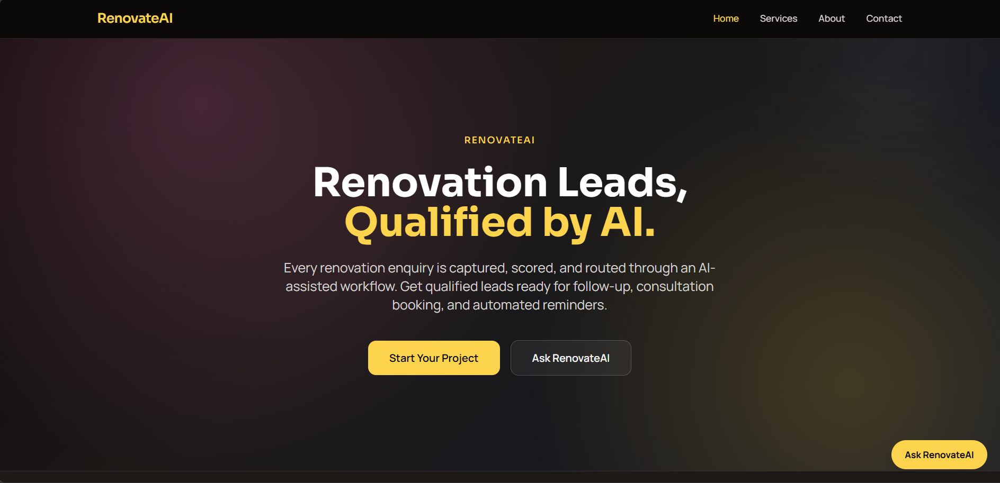

---

## Table of Contents

- [Highlights](#highlights)
- [Technologies Used](#technologies-used)
- [Key Features](#key-features)
- [AI Lead Scoring](#ai-lead-scoring)
- [Architecture](#architecture)
- [Usage Flow](#usage-flow)
- [Technical Deep Dives](#technical-deep-dives)
- [Scope & Design Notes](#scope--design-notes)
- [Deployment](#deployment)

---

## Highlights

- **Two intake paths, one pipeline** — an 8-field form and a guided conversational chat widget both feed the same n8n lead-processing workflow.
- **LLM-scored leads** — every submission is scored 0–100 and classified HOT / WARM / COLD by Gemini, driving both team alerts and follow-up tone.
- **Personalized follow-up emails** — instead of a static template, each lead gets an AI-drafted, tier-appropriate email, rendered into a styled HTML template and sent via Resend.
- **Spam-resistant validation** — honeypot field and disposable-email-domain filtering run server-side before any AI call is made.
- **Real-time team alerts** — HOT leads and AI scoring failures both trigger dedicated Slack notifications so nothing silently falls through.

---

## Technologies Used

### Frontend

- **Framework**: React 19 with TypeScript
- **Styling**: Tailwind CSS 3.4.14 for utility-first design
- **Routing**: React Router v6 for client-side navigation
- **State Management**: React Hooks (`useState`, `useEffect`, `useRef`)
- **API Communication**: Fetch API for interacting with backend services
- **Build Tools**: Vite 8.2.0 for fast development builds

### Backend & Workflow

- **Workflow Engine**: n8n 1.0+ for automating lead qualification and notification processes
- **Database**: Supabase for real-time data storage and lead management
- **AI Integration**: Gemini API for lead scoring/classification and personalized email copywriting
- **Email Delivery**: Resend API for transactional, AI-generated follow-up emails
- **Notifications**: Slack webhooks for team alerts on high-priority leads and AI scoring failures
- **Deployment**: Vercel for frontend hosting

### Infrastructure

- **Operating System**: Windows 11 (development environment)
- **Version Control**: Git with GitHub repository
- **Dependency Management**: npm 8.19.2

---

## Key Features

### 1. AI-Powered Lead Qualification

- **Technical Implementation**:
  - Gemini API analyzes lead data (project type, budget, timeline, description) and returns a score, classification, estimated value, urgency, and a recommended next action as structured JSON
  - n8n workflow triggers this scoring call automatically on every form submission or completed chat interaction
  - Lead records are upserted into Supabase with the full AI qualification payload attached
  - If the AI call fails or returns malformed data, the lead is still saved with an `UNSCORED` classification and flagged for manual review — the pipeline never silently drops a lead
- **Architecture**:
  - Lead data flows: Frontend → n8n (validation) → Gemini API (scoring) → Supabase (storage) → Slack / Resend (notification & follow-up)

### 2. Conversational Chat Widget

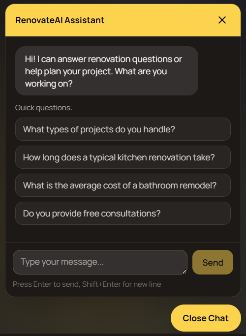

- **Technical Implementation**:
  - React component with state management for message history and lead data
  - Auto-growing textarea using CSS `max-height` and JavaScript `scrollHeight` calculation
  - Messages are exchanged with the backend via an n8n webhook, which runs the same validation and scoring pipeline as the form
- **UX Features**:
  - Typing indicator animation (bouncing dots)
  - FAQ prompt suggestions on first open
  - Guided-intake flow with explicit state transitions (`faq` → `guided-intake` → `review` → `complete`)
  - Inline error state with retry, so a failed request doesn't lose the user's place in the conversation

### 3. Automated Workflow Engine (n8n)

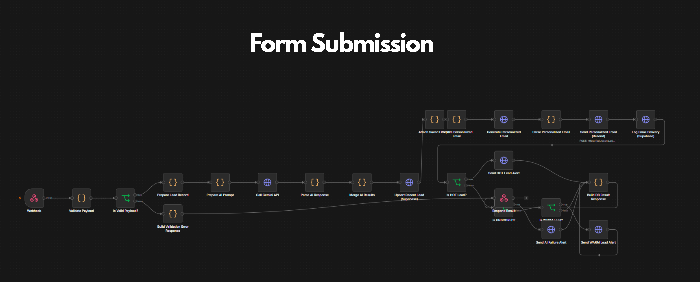
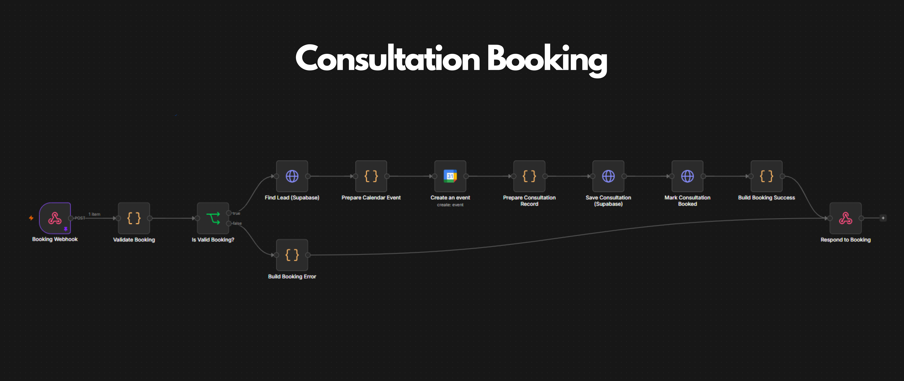
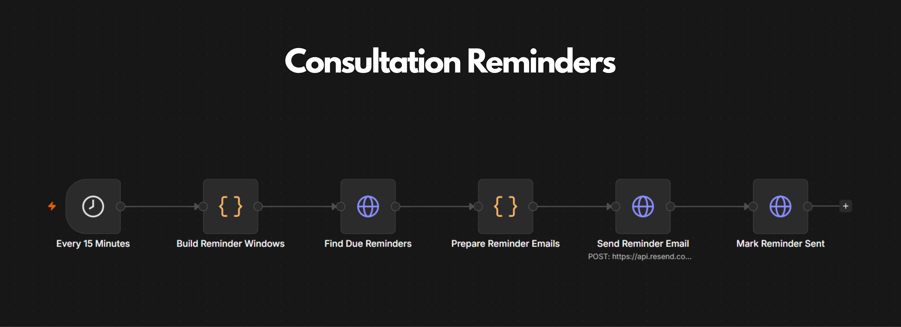
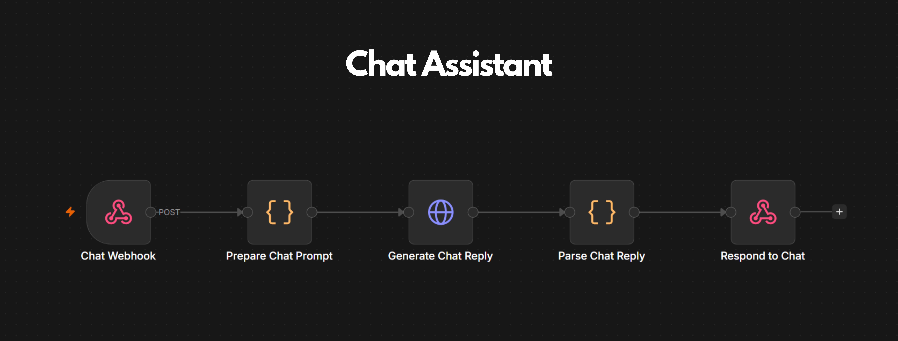

- **Pipeline Stages**:
  1. **Validation** — required-field checks, email format validation, disposable-domain blocking, and a hidden honeypot field to reject bot submissions
  2. **Scoring** — Gemini API call classifies the lead as HOT / WARM / COLD (see [AI Lead Scoring](#ai-lead-scoring))
  3. **Storage** — lead + AI qualification data upserted into Supabase
  4. **Alerting** — HOT leads and AI scoring failures each trigger a dedicated Slack webhook

     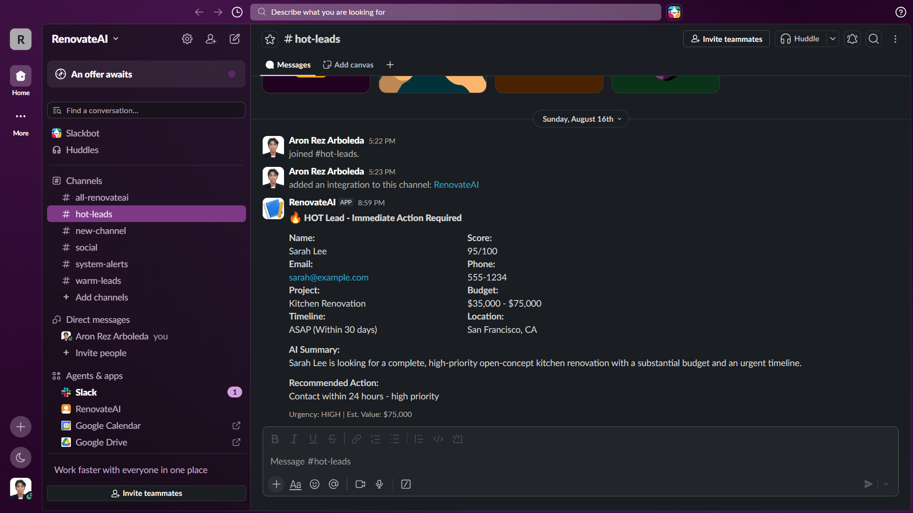

  5. **Follow-up** — Gemini drafts a personalized, tier-appropriate follow-up email, which is wrapped in a branded HTML template and sent via Resend; delivery is logged back to Supabase

     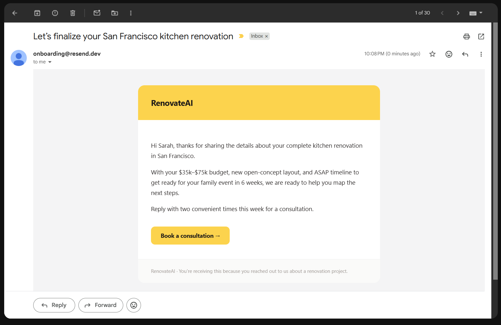

### 4. Responsive Design System

- **Technical Implementation**:
  - Tailwind CSS utility classes for responsive layouts
  - Media queries for mobile/desktop breakpoints
  - Reduced motion support via CSS `prefers-reduced-motion` media query
- **Performance**:
  - Code splitting via Vite
  - Optimized image loading (placeholder images in components)

---

## AI Lead Scoring

Every lead is scored 0–100 by Gemini based on budget, timeline urgency, and description detail, then bucketed into a tier that drives both internal alerting and the tone of the automated follow-up email:

| Tier            | Score Range | Internal Action                        | Follow-up Email Tone                    |
| --------------- | ----------- | -------------------------------------- | --------------------------------------- |
| 🔥 **HOT**      | 70–100      | Slack alert, contact within 24 hours   | Direct, consultation-scheduling focused |
| 🌤️ **WARM**     | 40–69       | Slack alert, follow up within 2–3 days | Helpful, answers-questions focused      |
| ❄️ **COLD**     | 0–39        | Added to nurture queue                 | Informational, no-pressure              |
| ⚠️ **UNSCORED** | —           | AI-failure Slack alert, manual review  | Generic fallback template               |

If the Gemini call fails outright (timeout, malformed response, missing fields), the workflow degrades gracefully to `UNSCORED` rather than blocking the lead from being saved — a human always gets notified instead of the lead disappearing.

---

## Architecture

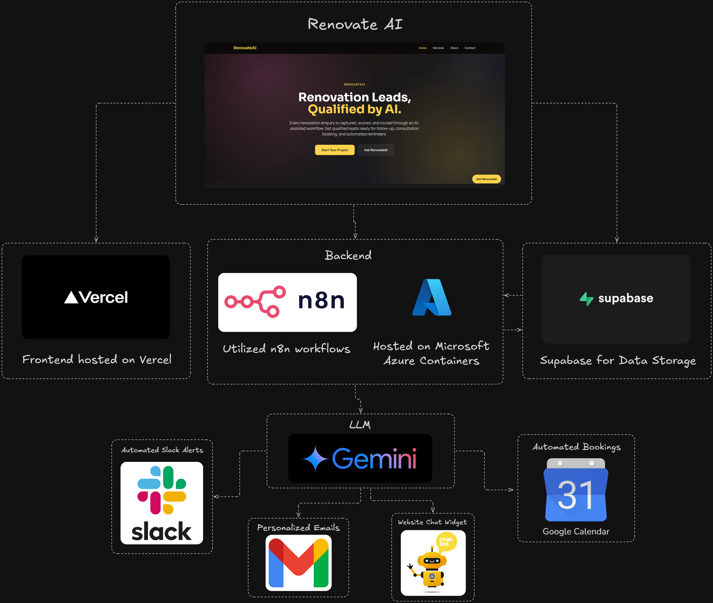

_Frontend (React) ↔ n8n Workflows ↔ Gemini API (scoring + copywriting) ↔ Supabase (storage) ↔ Slack / Resend (alerts + email)_

---

## Usage Flow

### Lead Form Workflow

1. Visitor fills out the 8-field form or interacts with the chat widget
2. Data is validated (required fields, email format, honeypot, disposable-domain check)
3. Gemini API scores the lead and assigns a HOT / WARM / COLD classification
4. Lead is saved to Supabase; HOT leads and scoring failures trigger Slack alerts
5. A personalized, AI-drafted follow-up email is generated and sent via Resend

### Chat Widget Interaction

1. User opens the chat panel
2. Conversational flow guides the user through intake, answering FAQs along the way
3. The system transitions between states (`faq` → `guided-intake` → `review` → `complete`) based on user input and backend responses
4. On confirmation, the completed lead is submitted through the same n8n pipeline as the form

---

## Technical Deep Dives

### Chat Widget State Management

```typescript
type ChatState = "faq" | "guided-intake" | "review" | "complete";
const [chatState, setChatState] = useState<ChatState>("faq");
```

- State transitions are driven by `nextAction` in the backend's response
- UI updates based on current state (e.g., the review screen appears when `chatState === "review"`)

### Lead Validation Logic

Validation runs twice — once client-side for immediate feedback, and again server-side in n8n as the source of truth:

```typescript
function validateLeadForm(values: LeadFormData): LeadFormErrors {
  const errors: LeadFormErrors = {};
  if (!values.name.trim()) errors.name = "Name is required.";
  // ... similar checks for other fields
  return errors;
}
```

Server-side, n8n additionally checks for a honeypot field and blocks a small list of disposable email domains before any AI call is made — keeping bot submissions from consuming API quota.

### n8n Workflow Nodes

- **Webhook** — receives form/chat submissions
- **Code** — validation, payload shaping, and response parsing at each pipeline stage
- **HTTP Request** — calls to the Gemini API (scoring and email copywriting) and Resend (email delivery)
- **If** — branches on validation result and lead classification
- **HTTP Request (Supabase)** — upserts lead records and logs email delivery
- **HTTP Request (Slack)** — posts HOT-lead and AI-failure alerts

---

## Scope & Design Notes

This is a demonstration project, and a few things are intentionally simplified rather than production-hardened:

1. Gemini API calls assume a valid key is configured; no mock/offline mode is built in
2. n8n workflow (webhook paths, environment variables, credentials) requires manual configuration per environment — it isn't packaged for one-click deploy
3. The chat widget's auto-growing textarea caps at 5 lines by design, not a technical limitation

---

## Deployment

### Frontend

- Deployed to Vercel with a custom domain
- Environment variables managed via the Vercel dashboard

### Backend

- n8n instance hosted on a private server
- Supabase database with role-based access control

---

For implementation details of specific components, refer to the source code in the `src` directory.

## Pages

<div style="text-align: center;">
  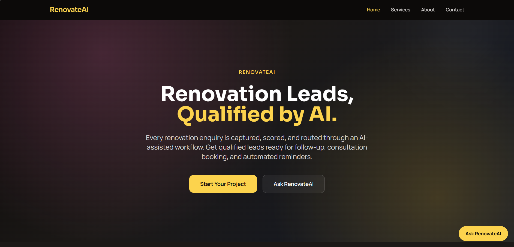
</div>

<div style="text-align: center;">
  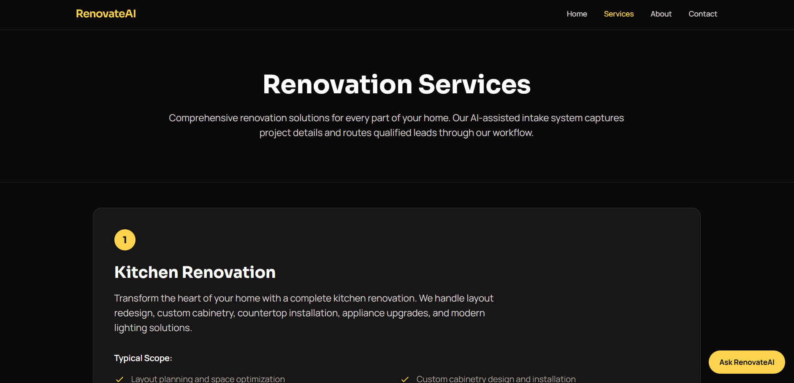
  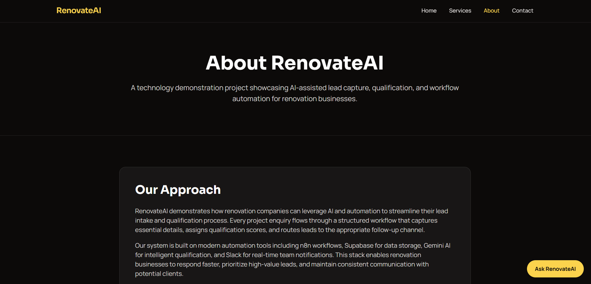
</div>

<div style="text-align: center;">
  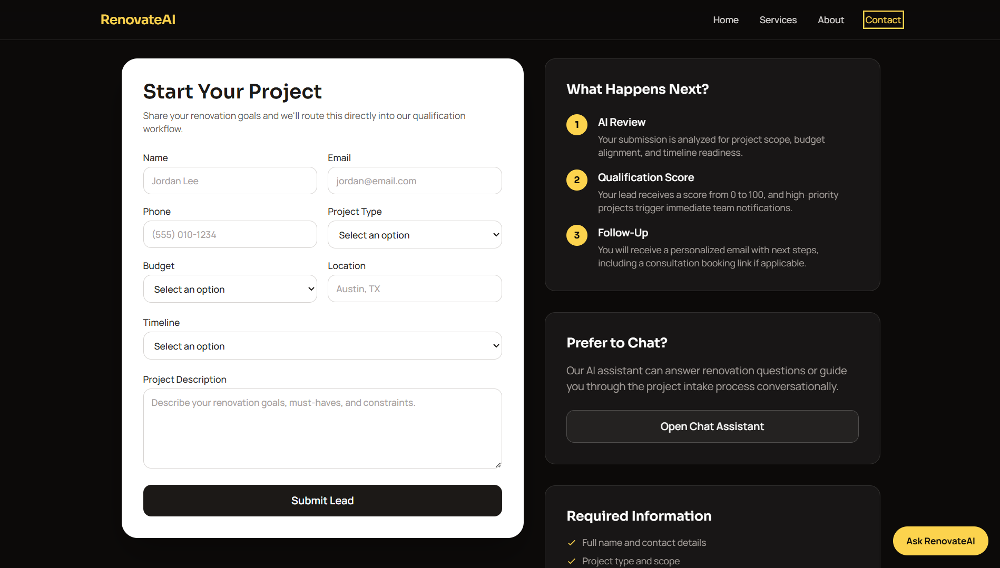
  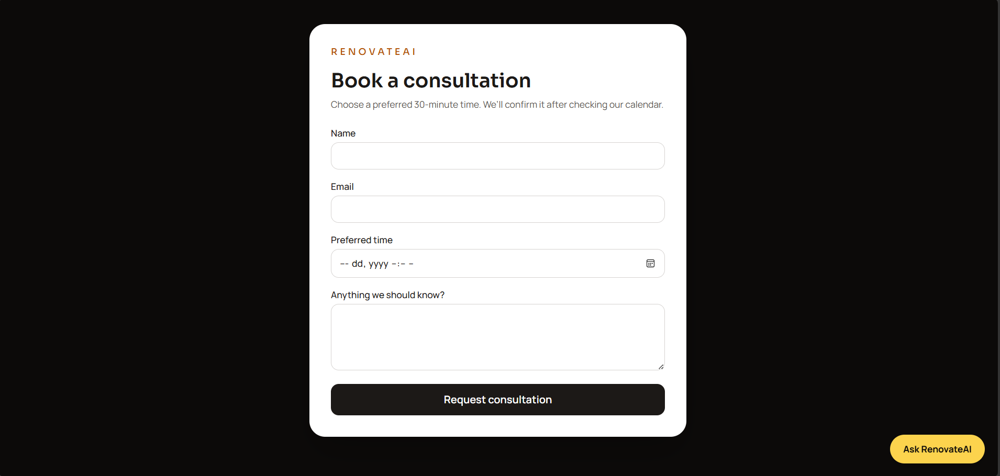
</div>
